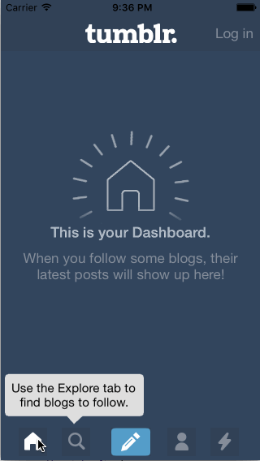

# Week 4 Assignment - *Tumblr*
Some interactions in Tumblr

Submitted by: Sam Huskins
Time spent: 12 hours spent in total

## User Stories
**Required:**
* [x] Tapping on Home, Search, Account, or Trending should show the respective screen and highlight the tab bar button.
* [x] Compose button should modally present the compose screen.

**Optional:**
* [x] Discover bubble should bob up and down unless the SearchViewController is tapped
* [x] Show the custom loading indicator by playing the sequence of pngs

## Video Walkthrough 

Here's a walkthrough of implemented user stories:

GIF created with [LiceCap](http://www.cockos.com/licecap/).

## Notes

Learned more about animation options.

## License

Copyright 2016 Sam Huskins

Licensed under the Apache License, Version 2.0 (the "License");
you may not use this file except in compliance with the License.
You may obtain a copy of the License at

http://www.apache.org/licenses/LICENSE-2.0

Unless required by applicable law or agreed to in writing, software
distributed under the License is distributed on an "AS IS" BASIS,
WITHOUT WARRANTIES OR CONDITIONS OF ANY KIND, either express or implied.
See the License for the specific language governing permissions and
limitations under the License.

